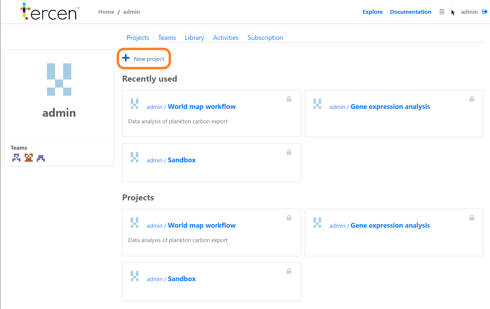
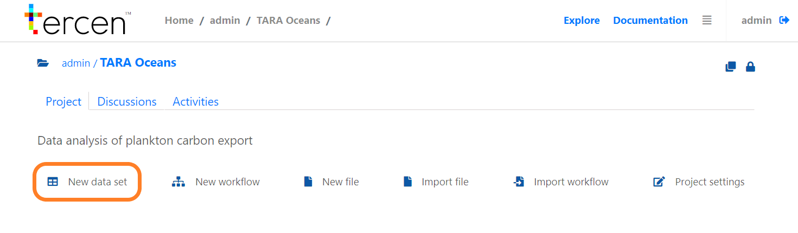
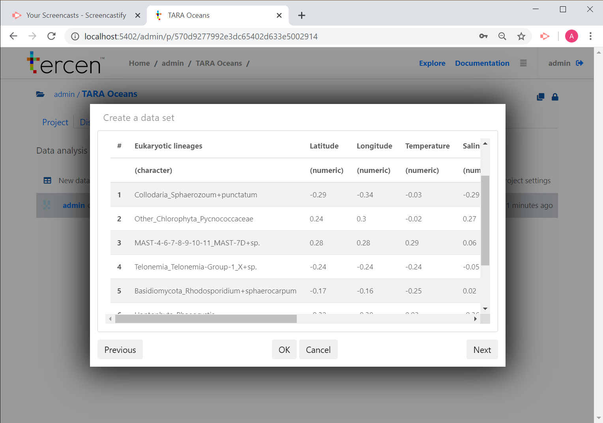
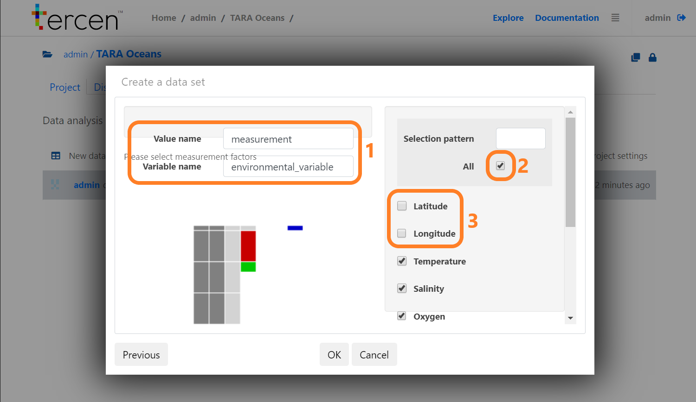
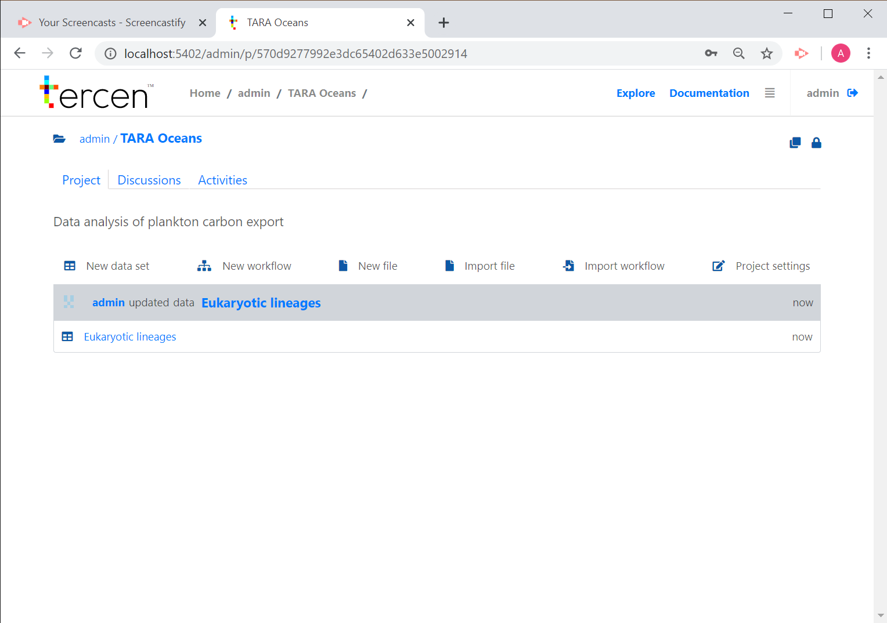
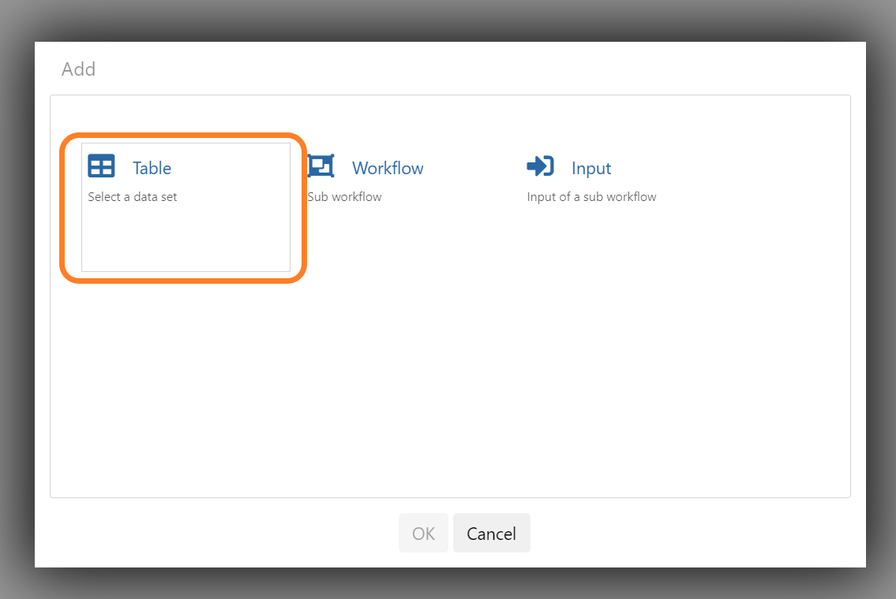
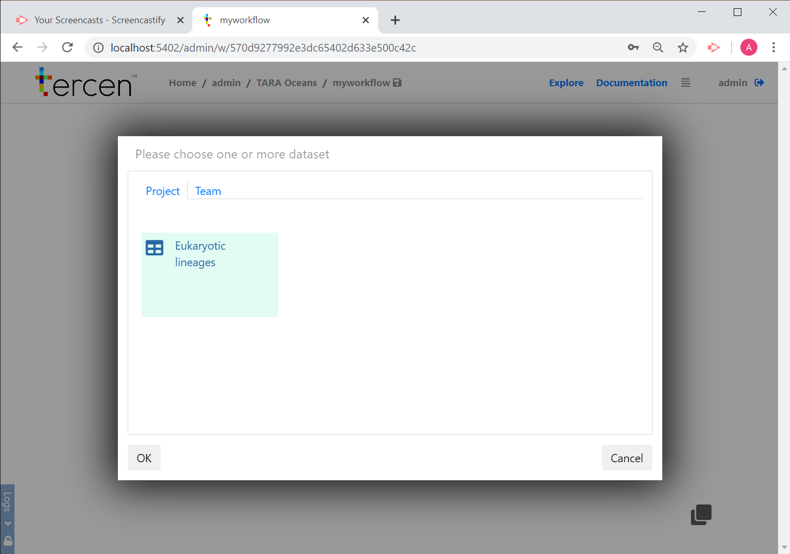
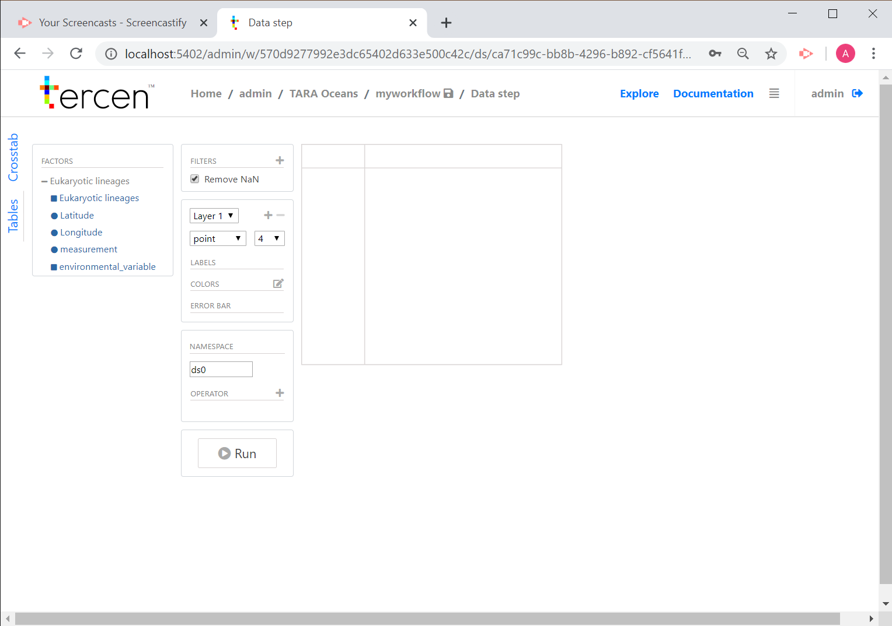
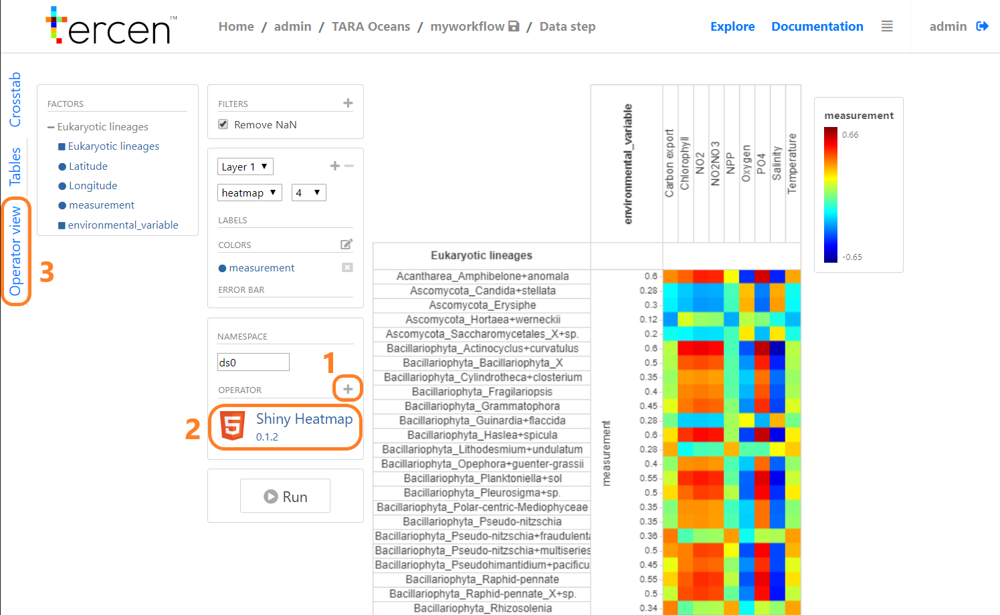

# Analysing TARA Oceans carbon export data using Tercen

This document describes a walkthrough example of data analysis and visualisation using **Tercen**. We will analyse data from the TARA Oceans project, coming from this publication: [Guidi et al. (2016)](https://www.ncbi.nlm.nih.gov/pmc/articles/PMC4851848/):

> Guidi, L., Chaffron, S., Bittner, L., Eveillard, D., Larhlimi, A., Roux, S., ... & Coelho, L. P. (2016). Plankton networks driving carbon export in the oligotrophic ocean. Nature, 532(7600), 465-470.

Our goal is to look at **how eukaryotic plankton lineages are associated to environmental parameters** such as **carbon export**. To do so, we will:

* create a new project in Tercen

* upload the dataset containing the correlation of different lineages to environmental parameters

* create a heatmap representing this correlation

## Creating a Tercen project {-}

First, we will create a Tercen project for our analyses.

* **Start Tercen** and **log in**

* Click on **New project**

* **Assign the team** of your choice to the project

* Give a **name** and **description** to this project, then click on **OK**

* Your project is now created !

## Loading data into Tercen {-}

We will use data from Guidi et al. (2016), more specifically the Supplementary Table 5.

**1. Download the data onto your computer**

You can find the data here: https://github.com/tercen/tara_gorsky2016_data. In this tutorial, we will just use the `SI5_eukaryotic_lineages.tsv` file.

**2. Go back to Tercen and load the data**

Now that we have the data on our computer, we can import it into Tercen.

* Go to the newly created project

* Click on **New data set**

* **Upload** the `SI5_eukaryotic_lineages.tsv` file (**1**)

* Give a **name** to the data set (**2**)

* Click on **Next** (**3**)

* Check that the data set has been loaded properly and click on **Next**

* Give a name to the values (here, `measurement`) and variables (here, `environmental_variable`) (**1**)

* Check all the variables (**2**)

* Uncheck the ones that are not part of the environmental parameters of interest (here, Latitude and Longitude) (**3**) and click on **OK**

* The data set is now uploaded to Tercen!

## Creating a workflow {-}

Now that we have created our dataset, we will **create a workflow** to analyse and visualise it.

* Click on **New workflow**

* Give a **name** to your workflow

* Your workflow appears now in your project. **Click on it**

* Your are now on the workflow environment that is empty. We will now **add the data set** we uploaded before. **Right click anywhere in the blank area** and click on **Add**.

* **Select Table** and click on **OK**.

* **Select the data set** and click on **OK**.

* Now the data set is ready to be used !

## Making a heatmap {-}

To analyse our data we need to:

**1. Add a data step to the workflow**

* **Right click** on the data set and select **Add**

* Select **Data step**

**2. Make the heatmap projection**

* Double click on the newly created **data step**

* Drag and drop elements to make the heatmap projection as in the following video:

<iframe src="https://drive.google.com/file/d/1jPIbcZGZFpHAnPLrlawR6S489_vEYc3H/preview" width="600" height="400"></iframe>

* We now have our first heatmap, our data projection should look like this:

**3. Improve the heatmap by ordering rows and columns and adding dendrograms**

This heatmap looks nice, but it would be better if we could order rows and columns and add dendrograms! That way we could see which species and environmental parameters cluster together.

Tercen includes a **heatmap operator** (called _Shiny Heatmap_) to make such a representation.

* In the sidebar, click on the plus sign to **add an operator** (**1**)

* Pick the `shiny_heatmap_operator`. It appears now the data step environment (**2**)

* Then click on **Operator view** tab on the left to see the result (**3**)

---

---

*Et voilà!* The operator view appeared, as well as our heatmap with a dendrogram:

---

---

## Making a world map {-}

Coming soon.
