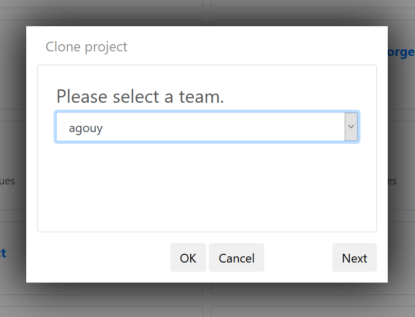

# How to copy the TARA Oceans workflow

This document describes a how to copy a public workflow in **Tercen**.

## Exploring existing public projects

## Copying a project to your own Tercen environment

